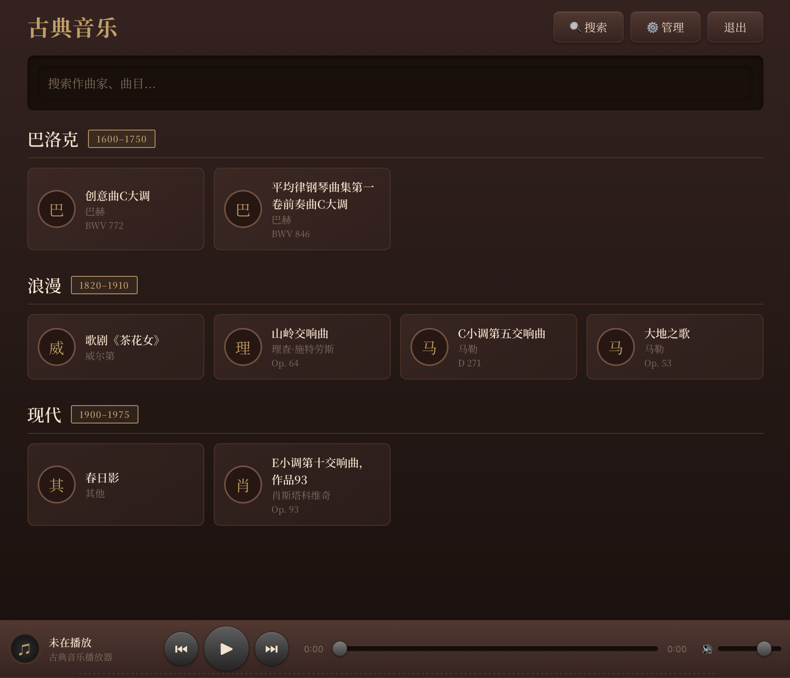
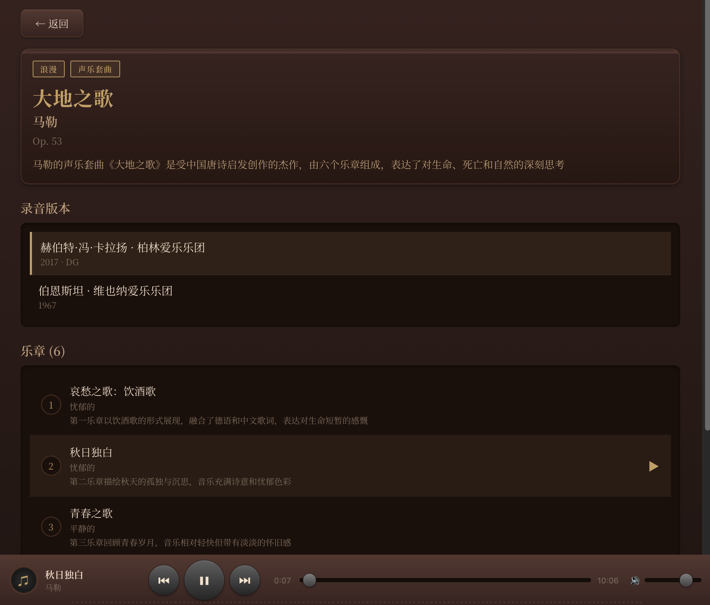

# 古典音乐服务器 (Classical Music Server)

这是一个用于在局域网 NAS 上管理、索引并通过 LLM 增强检索与播放体验的音乐服务器项目。传统的播放器都是通过文件名、ID3等标签来分类检索，而这里使用 LLM 元数据抽取与推荐。后端使用 Python FastAPI ，前端是一个 PWA 音乐播放器（Vue 3 + TypeScript）。

主界面按照创作风格对作品归类。



每个作品，可以选择不同的演奏版本收听。



## 主要特性

- 使用 LLM 从文件路径/ID3 等信息中抽取高级元数据（作曲家、作品名、调号、编号、时代、情绪等）。
- (TODO) 支持将 FLAC/CUE、APE、ALAC 等格式实时转码为前端可播放的格式（使用 `ffmpeg`）。
- 精确检索 + LLM 模糊检索（支持自然语言、语音检索与(TODO)哼唱检索的扩展点）。
- 基于作品与版本的播放模型（乐章、曲目、录音版本等概念）。
- (TODO) 播放完毕后基于风格的智能推荐。
- (TODO) 多语言支持，默认简体中文（`default_language` 可配置）。

## 技术栈

- 后端：Python + FastAPI
- 数据库：Postgres (+ `pgvector` 扩展用于向量检索)
- LLM：兼容 OpenAI 的 API（项目内可设置 `openai_api_base`/`openai_api_key` 等）
- 前端：Vue 3 + TypeScript + Vite，PWA 友好
- 部署：推荐使用 `docker compose` 一键部署

## 快速开始（推荐：Docker）

在仓库根目录运行：

```bash
docker compose up --build
```

这一命令会构建并启动后端、前端与数据库。

## 环境变量

后端通过 Pydantic Settings 从根目录 `.env` 加载配置，主要变量示例：

- `DATABASE_URL`（或代码中 `database_url`）: Postgres 连接字符串
- `SECRET_KEY`：JWT/加密用密钥（至少 32 字符）
- `OPENAI_API_KEY`、`OPENAI_API_BASE`、`OPENAI_MODEL`：LLM 配置
- `DEFAULT_LANGUAGE`（或 `default_language`）：默认界面/字段语言，默认 `zh-CN`
- `MUSIC_PATH`（或 `music_path`）：挂载的 NAS 路径，默认 `/music`

在仓库中，`backend/app/config.py` 列出所有可配置项（项目会从 `.env` 中读取）。

## 数据模型

- 最小物理单位：`audio_segments`（音频段，可为文件或大文件内的时间片段）
- 逻辑单位：`movements`（乐章）和 `works`（曲目/作品）
- 录音版本：`versions`，用于区分不同指挥/乐团/年代的录音
- 向量字段用于相似度检索（`pgvector`）

数据库示例与表结构参考请查看 `plan-old.md` 中的 SQL 片段。